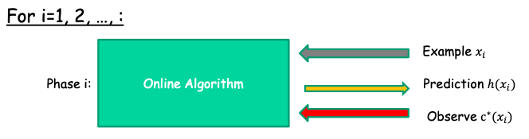

# 集成学习

[all from Robert E. Schapire, 2001, boosting survey]

Boosting：提高任何学习算法正确率的通用方法

* find a base learner (or weak leaner)
* 每一轮，用此learner学习training examples with different distribution or weighting。然后更新 distribution —— 如何更新？
* 最后 combine 每一轮的weak learner into a single strong learner —— 如何combine？

如何combine：一般来说就用多数投票的方法。As for combining the weak rules, simply taking a (weighted) majority vote of their predictions is natural and effective.

---

**The boosting algorithm AdaBoost** 

Given: $(x_1,y_1),...,(x_m,y_m)$ where $x_i \in X, y_i \in Y = \{-1,+1\}$ 

Initialize $D_1(i)=1/m$.
For $t=1,...,T$ : 

* Train base learner using distribution $D_t$.
* Get base classifier $h_t:X\to \mathbb{R}$ for distribution $D_t$.
* Choose weight $\alpha_t \in \mathbb{R}$ .
* Update: $D_{t+1}(i)=\frac{D_t(i)}{Z_t}\exp[-\alpha_t y_i h_t (x_i)]$ where $Z_t$ is a normalization factor (chosen so that $D_{t+1}$ will be a distribution), and $y_i h_t (x_i)$ is an indicator.

Output the final classifier:
$$
H(x)=sign(f(x))=sign(\sum_{t=1}^{T}\alpha_t h_t(x))
$$

---

**Training error**

更新 $D_t$ 的法则是最小化 training error

训练误差的上限由Freund and Schapire给出：
$$
\frac1m |\{i:H(x_i)\not= y_i\}| \le \frac1m \sum_i \exp(-y_i f(x_i)) = \prod_t Z_t
$$
Proof: Lec15 P22-27

训练误差上限随着 t 的增加，逐渐延伸，并且不断减小

所以为了减小训练误差 in a greedy way，我们需要最小化：
$$
Z_t =\sum_i D_t(i) \exp(-y_i f(x_i))=\sum_i D_t(i) \exp(-y_i \alpha_t h_t(x))
$$
从而，对于binary classifiers，我们可以得到：
$$
\alpha_t = \frac12 ln(\frac{1-\epsilon_t}{\epsilon_t})
$$
并且，此时训练误差上限为 $\exp(-2\sum_t \gamma_t^2)$，其中 $\gamma_t = 1/2-\epsilon_t$ 

因为该上限最大值为 $e^{-2T\gamma^2}$，所以训练误差随 T 的增大而指数减小

AdaBoost is doing a kind of steepest descent search to minimize training error‘s upper bound

**Generalization error**

generalization error is expected test error，is the *probability* of misclassifying a new example

Freund and Schapire 证明测试误差上限与 T 有关：
$$
\hat{Pr}[H(x)\not=y]+\tilde{O}(\sqrt\frac{Td}{m})
$$
$m$ : the size of the sample; $d$ : the VC- dimension of the base classifier space; $T$ : the number of rounds of boosting.

上式表明测试误差随着 T 的增加而变大，但是实际情况似乎不会过拟合

Schapire等证明上限与margin有关，独立于 T ：

margin就是分类正确和分类错误的D的权重之差：
$$
\begin{equation}
\begin{aligned}
margin_f(x,y) &= \frac{yf(x)}{\sum_t|\alpha_t|} = \frac{y\sum_t\alpha_th_t(x)}{\sum_t|\alpha_t|}
\\&=\frac{1}{\sum_t|\alpha_t|}(\sum_{t:y=h_t(x)}\alpha_t - \sum_{t:y\not=h_t(x)}\alpha_t)
\end{aligned}
\end{equation}
$$
上限：
$$
\hat{Pr}[margin_f(x,y)\le\theta]+\tilde{O}(\sqrt\frac{d}{m\theta^2})
$$
for any $\theta>0$ with high probability. (Lec16 P14)

基于margin的概念，产生了一堆的算法，比如感知机、SVM之类的

**感知机 perceptron**

1957 Rosenblatt，Lec16 P19

一种 Online Learning Model，二元分类的线形分类模型，判别方法，$f(x)=sign(w*x+b)$ 。得出一个特征空间中的划分超平面separating hyperplane。

**在线学习**

Example arrive sequentially.

没有任何假设：no distributional assumptions

目标：最小化错误个数（因为训练样本不是一次性给出，无法计算误差率）

