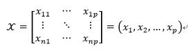
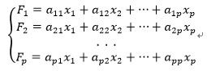

# 主成分分析

主成分分析（Principal Component Analysis，PCA）是一种在损失很少信息的前提下，把多个指标转化为几个综合指标的多元统计分析方法，它的核心是**数据降维**思想，即通过降维的手段实现多指标向综合指标的转化，而转化后的综合指标，我们称之为主成分。

其中，每个主成分都是众多原始变量的线性组合，且每个主成分之间互不相关，这使得主成分比原始变量具有某些更为优越的性能。在实际应用中，如果原始数据集本身较为复杂，那么使用主成分分析可以使我们仅需要考虑几个综合指标，而且又不至于损失太多信息。一方面，它更容易帮助我们抓住问题的主要矛盾；另一方面，它又极大的提高了我们的分析效率。

假设我们对某一事物的研究涉及到P个指标，分别用$x_1,x_2,...,x_p$表示，那么n个样本的数据矩阵为：

接着，我们对x进行线性变换，形成p个新的综合变量，即新的综合变量可以由原始变量线性表示，即：

模型需要满足以下条件：

1. $F_i, F_j$之间互不相关
2. 从i到p，F的方差逐渐减小
3. 各个F满足系数平方和为1

基于以上三个原则，得到的综合变量F，分别称之为原始变量的第一，第二，...，第p个主成分。在实际使用中，我们通常只挑选前几个方差最大的主成分，从而实现数据降维，达到简化系统结构的目的。