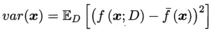
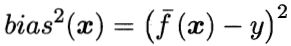
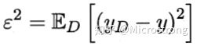
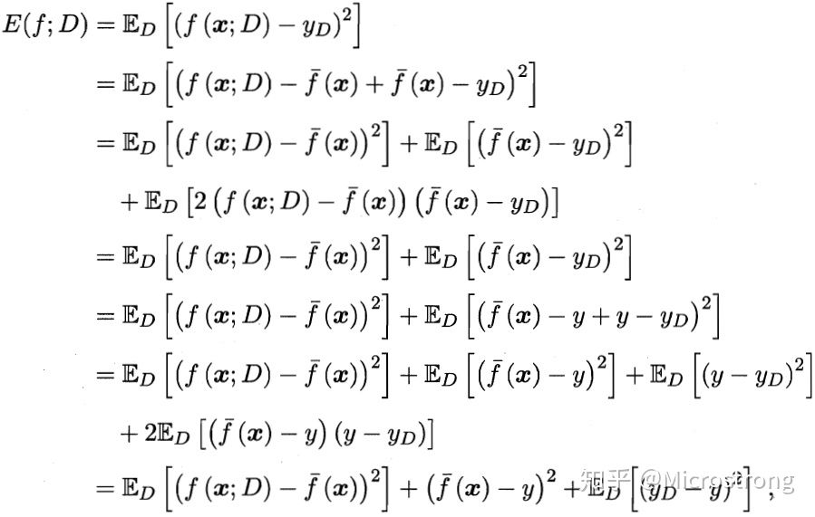
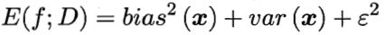

# 方差-偏差分解

bias-variance decomposition

训练数据集的损失与测试数据集的损失之间的差异就叫做泛化误差（generalization error）。

MSE分解（AllofStatistical Thm 6.9）

泛化误差可以分解为：

**方差（Variance）**：使用样本数相同的不同训练集产生的方差，即不同的训练数据集训练出的模型输出值之间的差异。

度量了同样大小的训练集的变动，所导致的学习性能的变化，即刻画了数据扰动所造成的影响。

**偏差（Biase）**：期望输出与真实标记的差别，即用所有可能的训练数据集训练出的所有模型的输出的平均值与真实模型的输出值之间的差异。

度量了学习算法的期望预测与真实结果的偏离程度，即刻画了学习算法本身的拟合能力。

**噪声（Noise）**：是数据集本身所致，学习算法无法解决的误差，数据的质量决定了学习的上限，在给定数据集的情况下，我们希望接近这个上线。

表达了在当前任务上任何学习算法所能达到的期望泛化误差的下界，即刻画了学习问题本身的难度。

偏差度量的是单个模型的学习能力，而方差度量的是同一个模型在不同数据集上的稳定性。

**分解过程**（假定噪声期望为零）：

于是，最终得到：

泛化性能是由学习算法的能力、数据的充分性以及学习任务本身的难度所共同决定的。给定学习任务，为了取得好的泛化性能，则需使偏差较小，即能够充分拟合数据，并且使方差较小，即使得数据扰动产生的影响小。

[参考](https://zhuanlan.zhihu.com/p/38853908)

