## 概率估计

我们可以通过求解概率函数$P(Y|X)$来估计$f:X\to Y$，若已知所有 RV 的 joint distribution，很容易可以算出概率函数的数值解，但是通常情况需要的样本太大，只能通过其他方法来估计$f:X\to Y$ 

1. be smart about how we estimate probability parameters from available data: MLE, MAP
2. be smart about how we represent joint probability distributions: Naïve Bayes, Bayes Nets

### MLE

Maximum Likelihood Estimation

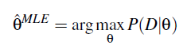

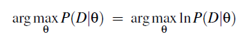

通常用$\ell (\theta)$表示$lnP(D|\theta)$，用$L(\theta)$表示似然函数$P(D|\theta)$ 

逐点最小化：

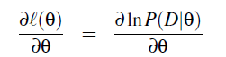

可得到所需参数$\theta$ 

### MAP

Maximum a Posteriori Probability Estimation

这是贝叶斯的方法，通过最大化后验概率，来使得参数估计可以容纳先验假设$P(\theta)$，其余和MLE相同

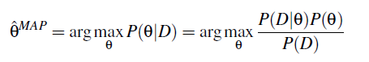

$P(\theta)$与$\theta$无关，只起到归一化作用，所以一般忽略为：

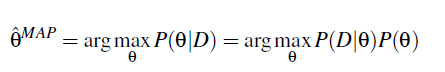

其中先验概率未知，其他都可以表示，一种对贝叶斯估计的批判就是人们通常为了简化计算选择先验概率，此处我们可以选择Beta distribution：

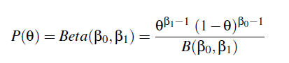

（参考ML version2 chapter2 Estimating Probabilities）

用这两种方法估计伯努利分布

## 分类

[CMU PGM](http://www.cs.cmu.edu/~epxing/Class/10708-14/lecture.html)

Graphical Models 给出了变量之间关联性的先验知识以及参数估计（MAP）的先验知识；联系观测到的训练数据，进行估计&学习（常用于：Diagnosis, help systems, text analysis, time series models, ...）

**核心问题**：处理高维随机变量 $p(x_1,x_2,...,x_p)$ 

**分类**：

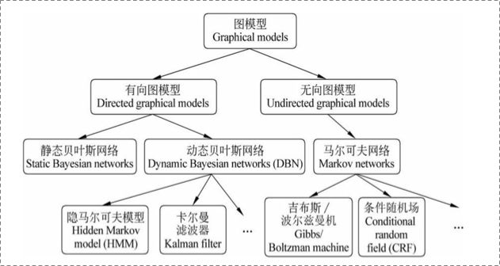

* 有向图 aka Bayesian Networks
* 无向图 aka Markov Random Fields

为了解决高维随机变量计算量巨大的问题，我们可以根据不同概率图表示的关系简化$p(x_1,x_2,...,x_p)$ 

**基本法则**：

* Conditional Independence：乘法$P(X|Y,Z)=P(X|Z)$ 
* Marginal Independence：加法/积分$P(X,Y)=P(X)P(Y)$ 

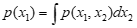

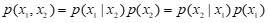

可推出两个常用法则：链式法则；贝叶斯法则

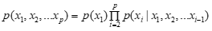

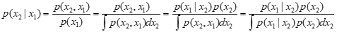

## Naïve Bayes

其实不算PGM，非常naïve的一个假设：所有维度相互独立，所以可以直接展开：

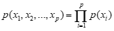

相对于Naïve Bayes的链式法则的展开，BN更加灵活的表示了条件独立关系，可以表示集合之间的独立关系，并且大大减少了独立参数的个数，从指数级降到了线性

属于生成模型

## Bayesian Networks

### Representation

BN包括：

* DAG：$G=<V,E>$ 
* CPD/CPT：$P(X_i|Pa(X_i))$ 

V之间的条件独立关系可由D-separated和Markov Blanket表述

Terminology:

* Parents = Pa(X) = immediate parents
* Antecedents = An(X) = parents, parents of parents, ...
* Children = Ch(X) = immediate children
* Descendents = De(X) = children, children of children, ...

分类：

* 静态贝叶斯网络：简简单单的根据DAG分解高维随机变量就行
* 动态贝叶斯网络 DBN：包括HMM和Kalman filters

Hidden Markov Model是针对时序分析的一种方法time series，RNN也是针对时序分析的（需要更多数据，分类精度更高）

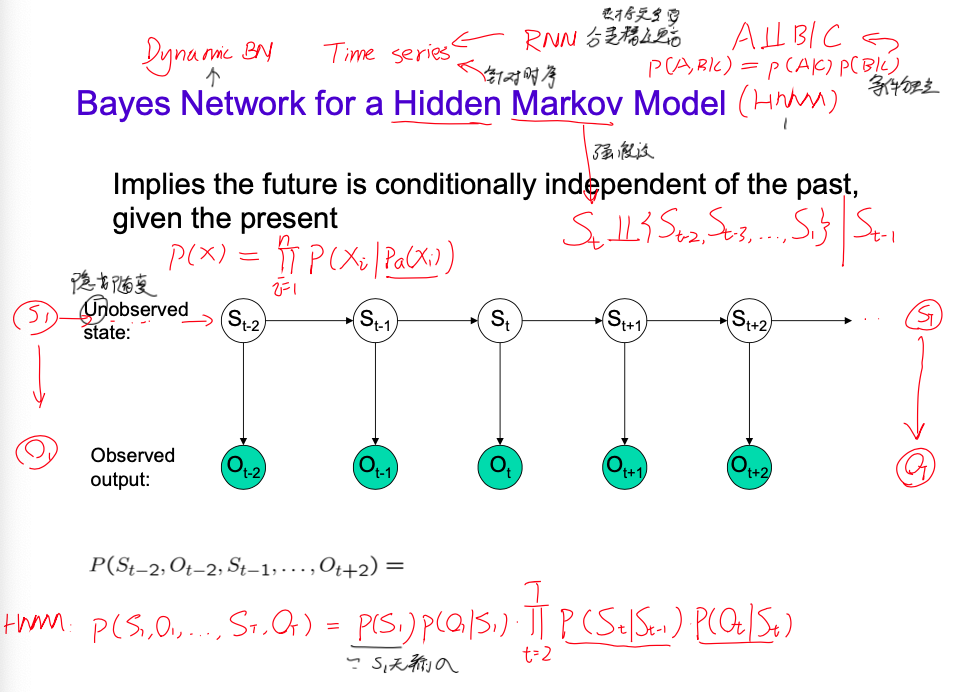

#### D-separated

作用：从图中找到条件独立关系，简化计算

三种基本拓扑结构：

* H-T和T-T：观测到C时，A与B之间通道阻塞，A与B独立；未观测到C时，A与B可通过C建立某种联系，A与B无marginal independent（$A \perp B |C$ & $A \not\perp B$  ）
* H-H：观测到C时，A与B反而受到联系，不再独立；否则是marginal independent的（$A \not\perp B |C$ & $A \perp B$  ）——explaining away

D-separated 其实就是三种基本拓扑节点关系的一个推广，将节点关系推广到集合关系。假定集合ABC相互之间不相交，若在A和C之间存在路径节点b，节点b和集合B之间满足关系：

1. 当b节点的拓扑关系为tail—tail, head—tail这两种类型是，$b\in B$ 
2. 当b节点的拓扑关系为head—head结构时，b节点及其<u>后继节点</u>一定不在B集合当中，$b \not\in B$ 

则$A \perp C |B$ 

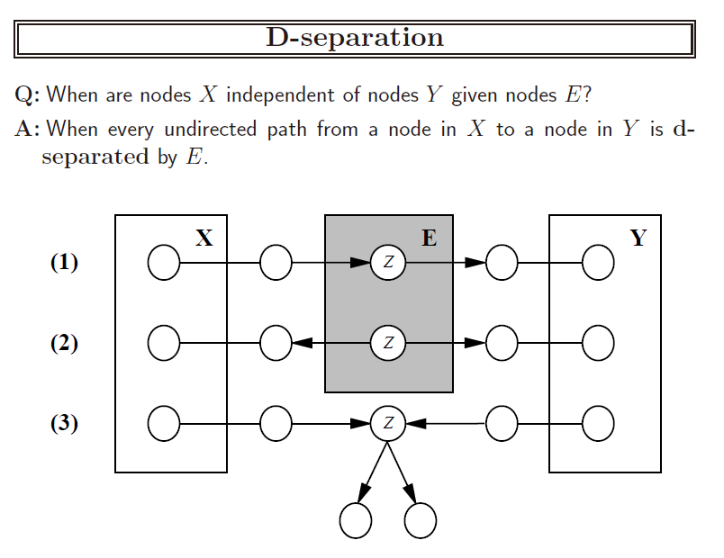

可以用马尔科夫毯来表示这种关系

#### Markov Blanket

概率图中，为了使其中一个节点和其它节点条件独立，我们用毯子盖住这个节点周围与其相关的节点，那么毯子外面的节点和这个节点就条件独立了。

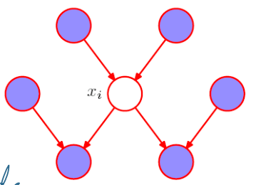

在基于全局节点条件下，求某一个节点的概率问题可以写为：
$$
p(x_i|x_{-i}) \propto \frac{p(x_i|x_{pa(i)})}{p(x_{ch(i)}|x_i,x_{pa(ch(i))})}
$$

#### Markov Random Fields

马尔可夫网络中，我们可以用势能 （$\phi_i$）来表示不同结点或结点团之间的影响力大小。

可以用联合分布（Gibbs分布）表示马尔可夫网络

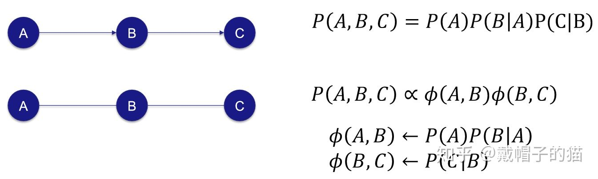

n阶马尔可夫假设（HMM是1-gram）下的马尔可夫过程：在一个过程中，每个状态的转移只依赖于前n个状态，并且只是个n阶的模型。

### Inference

要是能知道CPD，带入就好了

NP-hard问题

Approximate methods too, e.g., Monte Carlo methods, ...

P14

### Learning

Given training set D，find CPD

对于每个node i：

* 确定$Pa(X_i)$来设定CPD中待学习参数
* 找到该节点的概率密度函数和对应的似然函数
* 逐点最小化$L(\theta)$求得参数

HW3.3

* Easy for known graph, fully observed data (MLE’s, MAP est.)
* **EM** for partly observed data, known graph
* Learning graph structure: **Chow-Liu** for tree-structured networks
* Hardest when graph unknown, data incompletely observed

#### EM算法

Expectation - Maximization：是为了在概率图已知，数据未知或者部分未知的情况下应用bayes的算法

* 初始化 theta
* E-step：用 $X$ 和 $\theta$，计算 $P(X,Z|\theta ')$ 
* M-step：更新theta：$\theta \to \arg\max\limits_{\theta '} Q(\theta '|\theta)$ ）
    * 对于MLE来说：$Q(\theta '|\theta) = E_{P(Z|X,\theta)}[\log P(X,Z|\theta')]$ 

Usupervised clustering is just extreme case for EM with zero labeled examples

EM for Mixture of Gaussian Clustering：Lec11&12P21

#### Chow-Liu算法

如何构建概率图？

Chow-Liu Algorithm：minimizes Kullback-Leibler divergence，to finds “best” tree-structured network
$$
KL(P(X)||T(X)) \equiv \sum_k P(X=k)\log \frac{P(X=k)}{T(X=k)}
$$
To minimize $KL(P || T)$ , it suffices to find the tree network T that maximizes the sum of mutual informations $I(A,B)$ over its edges (like between variable A and B)
$$
I(A,B) = \sum_a \sum_b P(a,b) \log \frac{P(a,b)}{P(a)P(b)}
$$
for tree networks with nodes $X \equiv <X_1,...,X_n>$ 
$$
\begin{equation}
\begin{aligned}
KL(P(X)||T(X)) &\equiv \sum_k P(X=k)\log \frac{P(X=k)}{T(X=k)} \\&= -\sum_i I(X_i,Pa(X_i)) + \sum_i H(X_i) - H(X_1 ... X_n))
\end{aligned}
\end{equation}
$$

1. for each pair of vars $A,B$, use data to estimate $P(A,B), P(A), P(B)$ 
2. for each pair of vars $A,B$ calculate mutual information $I(A,B)$ 
3. calculate the *maximum spanning tree* over the set of variables, using edge weights $I(A,B)$  (given $N$ vars, this costs only $O(N^2)$ time)
4. add arrows to edges to form a directed-acyclic graph
5. learn the CPD’s for this graph