# Lecture 1

公司需要在很多Investment opportunities中选择最好的一个

就需要evaluate projects的价值，进行Capital budgeting（资本预算）

* 统一时间，比较不同时间的资金流（cash flows）—— time value of money
* 评估项目价值的准则：The Net Present Value rule（NPV）
* 其他评估法则

## 1. Time value of money

同等大小资金，今日的总优于未来的：未来有Uncertainty、Inflation通货膨胀、Opportunity cost

复利（compounding）：本利共同作为下一期的投入

### Future Value

在复利的基础上，估算今日资金流的未来价值

If you invest S units for T years at an interest rate r, you will get the future value

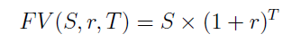

* 年利率 Annual rate, annual nominal interest
* 实际年利率 Effective annual rate(**EAR**)：如果年利率是 $r_a$，每年复利 $k$ 次，每期利率r/k，每年实际利率为 $EAR=(1+r_a/k)^k - 1$ 
	* 复利次数k越多，EAR越大
	* continuous compounding: 当k趋向于∞，EAR趋向于 $e^r − 1$ 

**年利率r怎么估计的：**

* The yield curve(YC)：give us the interest rate for risk-free securities as a function of the maturity of the loan.（Part II）
* Plus a premium for risk

**Nominal vs. Real interest rates**

通货膨胀侵蚀购买力（Inflation erodes purchasing power），所以，真实利率 $\approx r- \pi$ 

### Present value and Discounting

依然在复利的基础上，估算未来资金流的现在价值

Present Value：贴现率为r的情况下，T年后若想要拿到S，今天需要投资PV

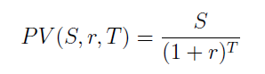

discounting：贴现 discount rate，就是复利时利率的反面说法

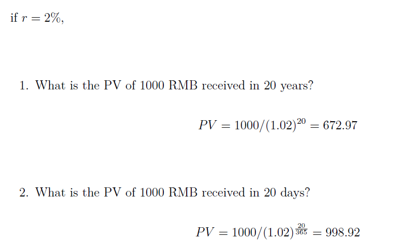

注意：年利率r可以直接除365来获得日利率（**默认复利**）

* PV反比于 r 和 T ：利率越高，时间越长，两个时间的价值变化越大。
* 今日收获PV = t时刻收获S
* 为了比较未来不同时间点的cash flow，我们需要比较他们的PV

## 2. Multiple Cash Flows

在不同时间点有不同的资金流动（同方向），那么折算为今日的资金流（同方向）时有独立性

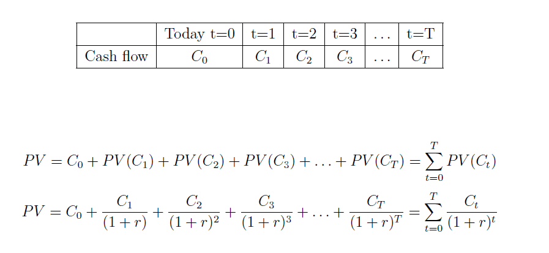

此时每个时间段都是包含本金的

### 永续年金 Perpetuities

因为这是一个无穷的constant cash flow，所以今日投资后未来就不能拿出本金，而是每期取出该期生成的利息

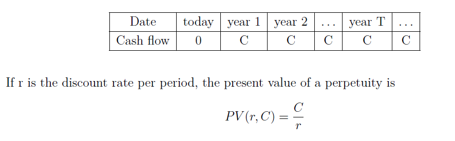

比如：British Consol issued

> What is the present value of a British Consol issued today that **pays 5 per month in perpetuity**? The annual discount rate is 6%.

[link]([https://wiki.mbalib.com/wiki/%E6%B0%B8%E7%BB%AD%E5%B9%B4%E9%87%91](https://wiki.mbalib.com/wiki/永续年金)) 

### 增长年金 Growing perpetuities

同样是无穷的cash flow，每期要求按照 g 增长，相当于每期的利率 r 减少了 g

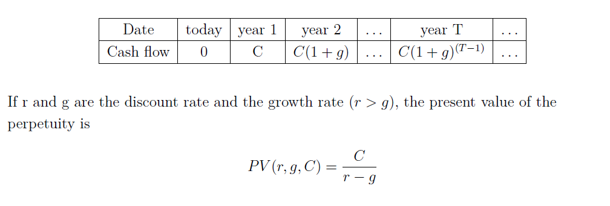

### 普通年金 Annuity (ordinary annuity)

普通年金是指从第一期起，在一定时期内每期期末等额收付的系列款项，又称为后付年金。

普通年金的PV：每期都流动C，相当于一开始一次性流动PV：

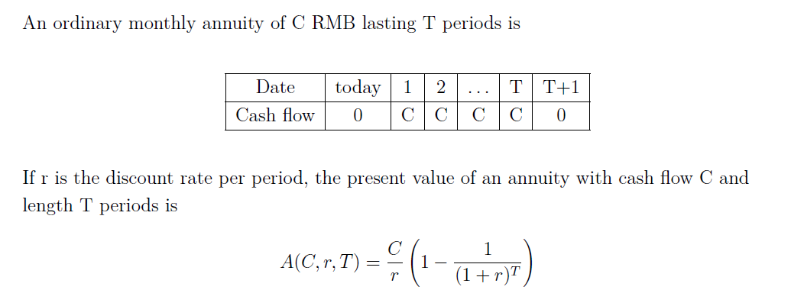
$$
A(C,r,T)=C(\frac{1}{(1+r)^1}+\frac{1}{(1+r)^2}+...+\frac{1}{(1+r)^T})
$$

> **例：**现在存入一笔钱，准备在以后5年中每年末得到100元，如果利息率为10%，现在应存入多少钱?　

普通年金的FV：每期都流动A，相当于最终一次性流动（补充）

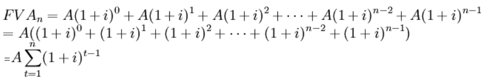

> **例：**5年中每年年底存入银行100元，存款利率为8%，求第5年末年金终值为多少。　

## 3. Capital budgeting

目标：衡量是否应该invest $I_0$ in a project that yields cash flows $[C0,C1,C2, . . .]$ in the future

NPV：一个项目的PV和future cash flows + initial investment的差距

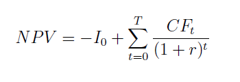

* NPV为正时接受项目
* 选择最大的NPV：当公司选择投资positive-NPV project，公司价值(and hence shareholder value)增长NPV

### 如何选择discount rate——OCC

一般来说，NPV将随着r的增加而降低

合适的r是公司在保持风险不变的情况下从其他地方的替代投资（例如，债券市场）获得的收益率

OCC：替代投资的费率，资本机会成本（Opportunity Cost of Capital）

* 项目没有风险（不太可能）：选择与项目相同期限的国库券 T-bill 收益率作为NPV计算的折现率
* 项目有风险：量化其风险，并采用具有相同风险程度的金融资产收益（Part II）

### 如何预测cash flow——IS

Income Statement: Firms report revenues, costs and profits, are written with accounting profits in mind, not cash flows

评估项目价值时，我们需要cash flow的信息，而不是accounting profits

Important rules:

* Use cash flows, not accounting numbers
* Use incremental cash flows: CF(w/ project) - CF(w/o project)
* Use nominal discount (interest) rates for nominal CFs
* Use real discount (interest) rates for real CFs
* Use after-tax CFs
* Do not include sunk costs in the NPV calculation

如何从IS中提取相关信息？

1. 不要使用沉没成本 Do not use sunk costs: money paid before the project is already lost
2. 消除非现金项目 Eliminate non-cash items (such as depreciation贬值)
3. 扣除营运资金变动 Deduct changes in working capital
4. 考虑项目结束时资产的转售价值 Consider resale value of assets at the end of the project

---

Working capital：

营运资金是经营业务所需的现金

Working capital = (Accounts receivable) + (Inventories) - (Accounts payable)（应收账款）+（库存）-（应付账款）

一年内增加营运资金会减少当年的现金流量cash flows

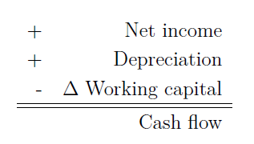

## 4. Alternative investment criteria

### Payback period criterion

“Payback period” = 收回初始成本的年数

Minimum acceptance criterion：由管理层设定

Ranking criterion：选择回报最快的项目

优点：

- 容易明白
- 偏向流动性

缺点：

- 忽略time value of money
- 忽略了payback period之后的cash flows
- 对长期项目有偏见
- 需要arbitrary接受标准
- 根据投资回收期标准接受的项目的NPV可能为负

### IRR

Internal Rate of Return内部收益率

The discount rate that sets NPV = 0

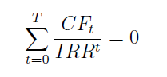

Minimum acceptance criterion：如果内部收益率超过项目要求的回报率，则接受

Ranking criterion：选择具有最高IRR的方案

### Normalized NPV

Normalized NPV = NPV  \ initial investment

Acceptance criterion：由管理层设定

Ranking criterion:：选择N-NPV最高的项目

缺点：忽略了项目之间的规模差距

# Lecture 2

Portfolio Theory 投资组合理论

## Risk

The measure we will use is the standard deviation of returns.

Risk premium 风险溢价：stock与T-bills之间的收益率差额是stock的风险溢价（Risk-return trade-off）

- T-bills are essentially risk-free
- Stocks are risky: high volatility波动性，但有compensations补偿

## Portfolio

投资组合的几个属性：price number return

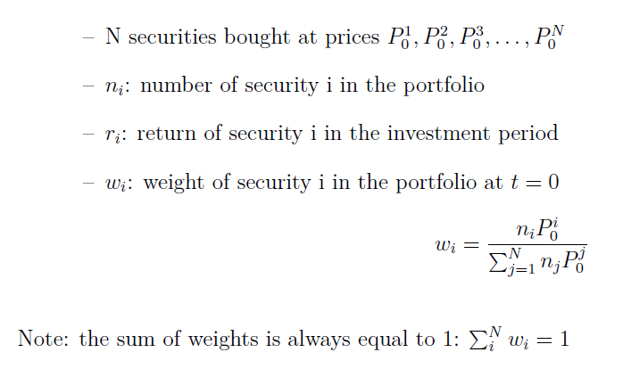

我们需要计算portfolio中各种securities的组合比例，用价值来计算，而不是shares

## Portfolio return

回报率 $r_i$ 是从Capital Budgeting得出的

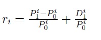

D是security的股息dividends（分红之类的）

对于一个投资组合来说，回报率 $r_p$ 等于各个成分的回报率的加权值

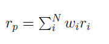

## Short sales

Def: Sell a security you don’t have

Make money if the stock goes down

- 在t = 0时 高价卖出：卖空者从其经纪人broker那里借入证券并将其出售
- 在t = 1时 低价买入：卖空者通过购买证券并将其退还给经纪人来平仓closes the short，赚取差价
- 卖空者必须支付股票支付给经纪人的任何股息dividends（通常还有少量手续费）

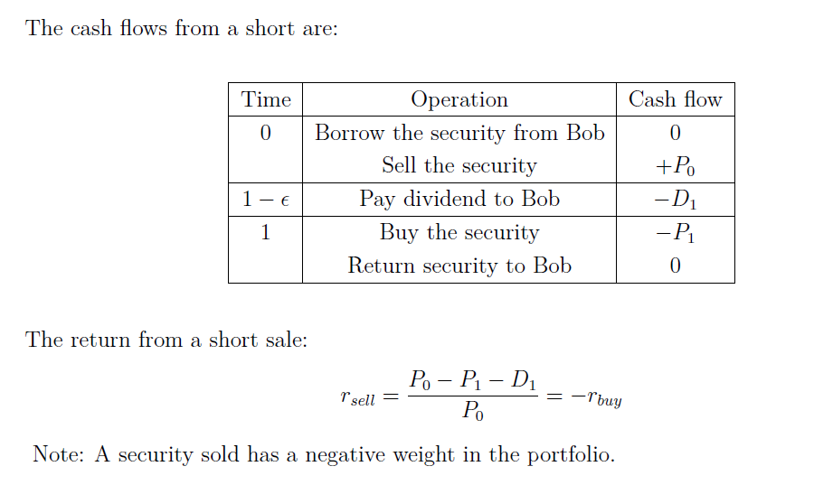

portfolio中负的weight通常都是做空

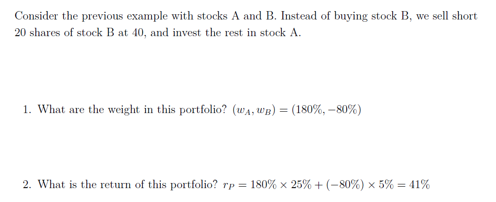

## Expected portfolio return

投资组合的回报期望 $E(r_p)$ = 各个成分投资回报期望的加权和（weight是价值权重）

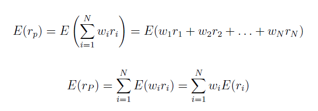

例子：

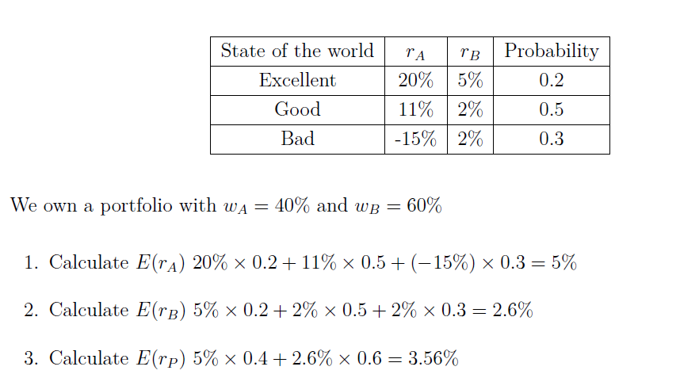

先计算各个成分的期望，再计算组合期望

## Variance and Standard deviation of returns

用$E(r_p)$计算 $var(r_p)$、$cov(r_a,r_b)$、$\rho_{AB}$ 

方差和标准差：

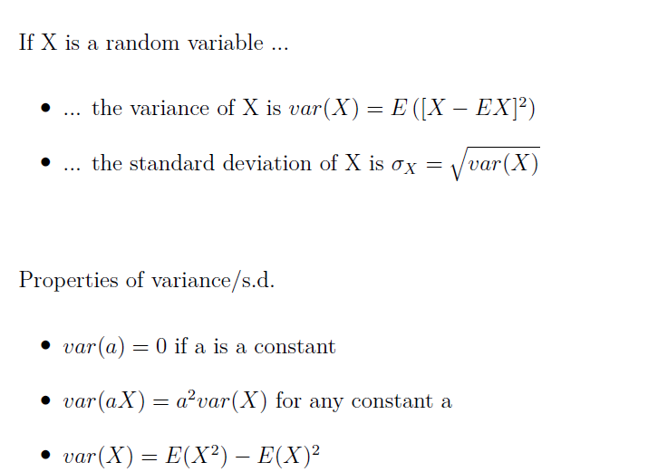

投资组合的方差：

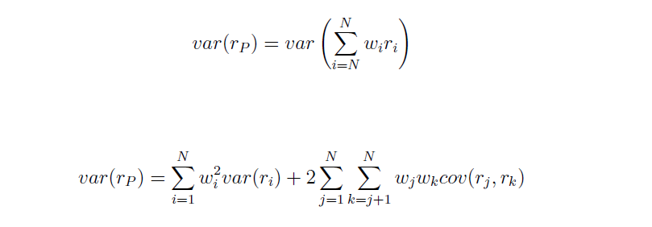

协方差计算：

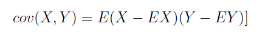

归一化协方差：

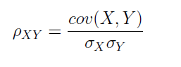

例题1：

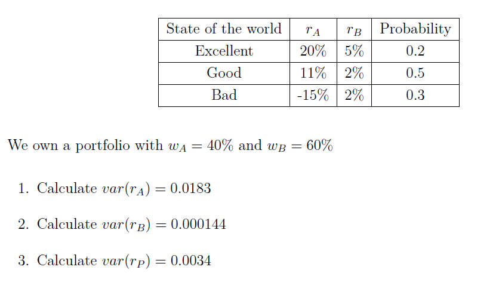

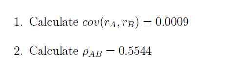

例题2：

因为协方差为负数时可以减少portfolio的回报风险，我们应该选择风险更小的投资组合

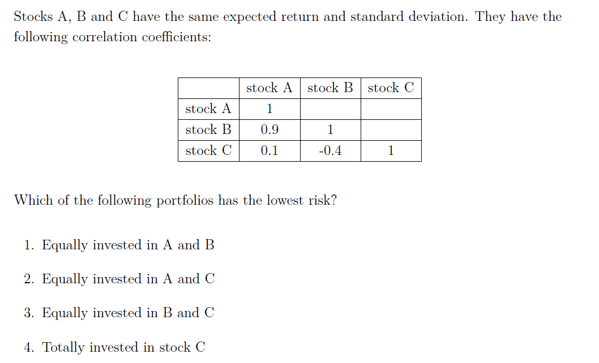

## Diversification

Diversification is good, it reduces risk

投资组合多样性用各种投资成分之间的$\rho_{AB}$衡量，计算risk $\sigma_p$ 时可发现，risk与$\rho_{AB}$有关

所以我们希望找到可以最小化variance of portfolio的weight组合：

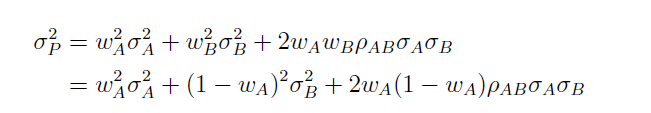

Then differentiate w.r.t. to $w_A$:

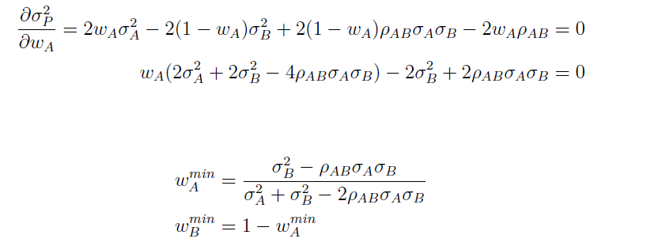

Notes：

• 做空是可能的 (wA < 0)
• With the exception of the special case where $\sigma_B = \sigma_A \rho_{AB}$ , the minimum variance portfolio never consists of investing in security B alone
• If $\rho_{AB} = −1$, the minimum variance portfolio built with risky securities A and B is risk-free. If $\rho_{AB} = 1$ and if short-sales are allowed, it is possible to construct a risk-free portfolio with securities A and B
• $\rho_{AB} =\pm1$ are interesting cases (but extremely unlikely)

所以diversification可以减小的风险，但是有局限：Total risk in a portfolio consists of (1) firm-specific (idiosyncratic) risk, and (2) market
(systemic) risk.

1. Idiosyncratic risk comes from innovations, strikes, CEO-health, CEO misconduct, etc.,which are not correlated across companies——This risk is diversifiable!
2. Systemic risk comes from the state of the economy, political stability, the taxation system, wars, etc., which are common to all firms（This results in positive correlation across company returns）——This risk is undiversifiable!

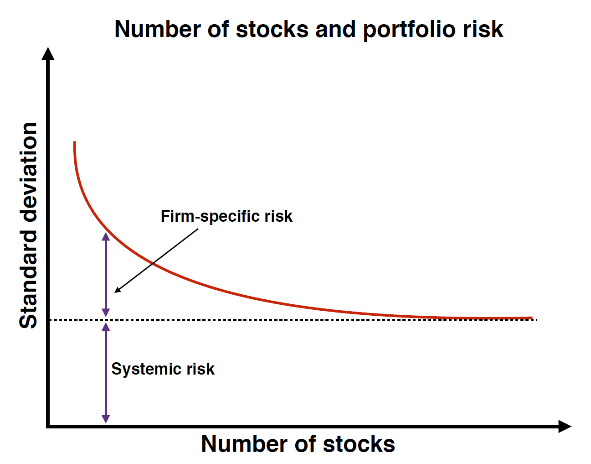

## 最优化投资组合Estimating return distributions

1. 如何在给定风险水平下提供最高预期收益的意义上构建有效的投资组合？

2. 如何在可供投资者使用的不同有效投资组合中进行选择？

下一步：

1. 定义所有可行投资组合的集合：给定一组证券，确定所有可能的预期收益和风险组合$E(r_P)$ ，$\sigma_P$可获得

2. 在可行的投资组合中，确定每个风险等级$\sigma_P$具有最高$E(r_P)$ 的投资组合

3. 使用投资者行为模型来选择最适合特定投资者的个人投资组合

### one risk-free asset and one risky asset

# Lecture 6

