[艺术史大纲.pdf](https://www.notion.so/e5d401b349e24f359a91843203ce0ce0#407d2b5708264c598c5dc6946c7568b6)

待整理更新

# 1. 早期

艺术：

* 造型艺术——实用美术（建筑）（画画、雕塑、创作的）
* 纯艺术——泛艺术化（表演等）
* 排他性消费与收藏（只有一件，只有一个人能买；电影就是非排他性）

史：

* 研究的——非品鉴，学历史需要有脉络，建立整个网络
* 史学——不是故事，考证辩证的，有很多是存疑的（供养人艺术史——苏东坡、乾隆买的；批评家艺术史——站在旁观者学术的角度评价；艺术家的艺术史）

古希腊——古罗马——中世纪——文艺复兴——巴洛克——洛可可——新古典主义、浪漫主义、现实主义——印象主义——现代主义——当代艺术

## 一、古希腊 古罗马 中世纪

### 古希腊

中国的宗教、玉皇大帝什么的都是精神上的并且衣服很多的；古希腊就不是

地域上非现在的希腊

四阶段：

1. 克里特文明：克里特岛是贸易中转站中心（古埃及、两河文明都很好的输入 很早接受了先进文化）（青铜时代 标志 青铜器 文字 城市「阶级 宴会 思想传播」）（夏朝）
2. 迈锡尼文明：特洛伊战争、荷马史诗（一堆的小国家县长）（商朝）
3. 古希腊城邦阶段：雅典 斯巴达 波希战争（波斯已经崛起和希腊）（温泉关战役 马拉松战役）（艺术：古风时期（木讷站立的雕像） 「古希腊时的」古典时期（有动作的雕像））（春秋战国时期）
4. 马其顿帝国：亚历山大大帝东征（把古希腊的文明再次反馈带回给）（军事家：汉尼拔 凯撒 拿破仑）希腊成为古罗马行省（艺术：希腊化 传播开去了 古罗马）（战国-西汉）

古风：形容直着站着、一定有僵硬的微笑

重心：衡量雕塑的动感

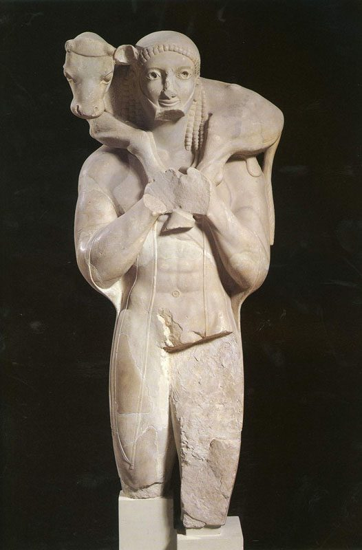

  

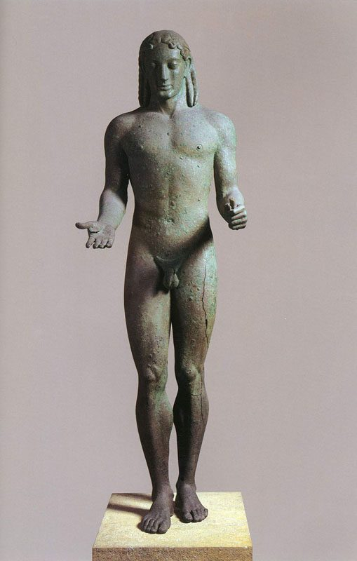

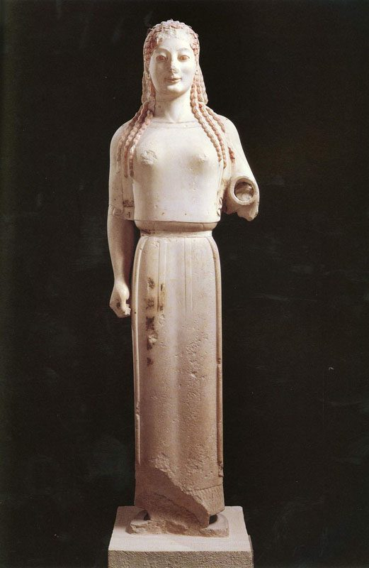

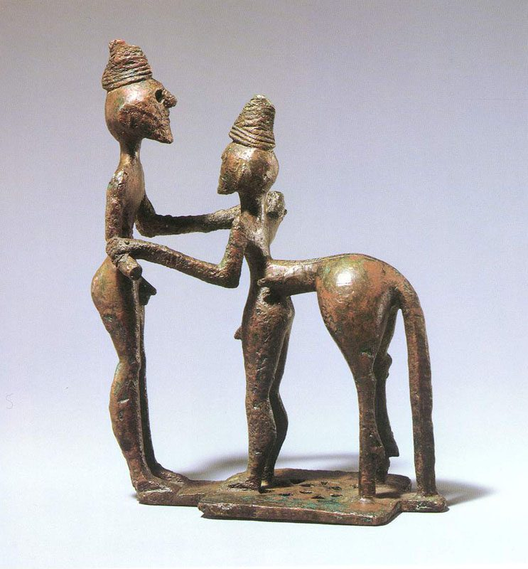

### 古典：

雕塑动态感：关节朝向不同的方向

开始描述战争——有宏大叙事，主题创作，一种主动的创作行为，就分开了国家美术和民间美术

《驾车人》——艺术开始描绘贵族时期，青铜，衣服纹理质感有了更多的表达

《刺客》腿部肌肉群、皮肤纹理等等做的非常好了，有腿部支撑

《维纳斯的诞生》后世做也不过如此了，很难超越，浅浮雕（高浮雕）

青铜：当时应该是上色的，是亮晶晶的，不想现在这么古典，古希腊会雕塑当代人，比如驾车的、奥运会的（被认为被神眷顾）

雕塑技术先是腿部开始好

古希腊希望做出超越性的神性的，所以每个人都差不多；古罗马就不一样

古希腊做人面部表情都差不多，写实但不真实，呈现的是神性，不是真人

《命运三女神》判断角度（肌肉群、衣纹）

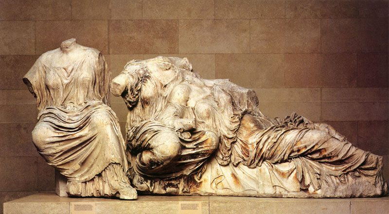

体现了文明的丰富性（报鹅的少年）民间的、（拳击者）奴隶阶层

中国大多都是量大，体量取胜 画出来的衣纹 不是塑造形体出来的 中国美学一直趋于平面化

有了剧情化，悲剧意识，不再只是战争宏达感

注意衣纹的垂感和动感（写实能力）

《众神与巨人之战》有了蒙太奇的概念，柏林艺术馆，开始有了夸张，猛兽等

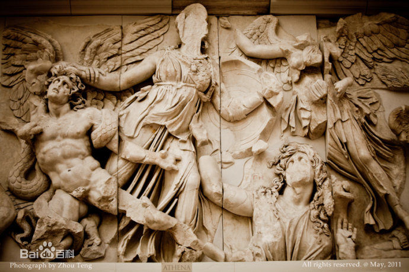

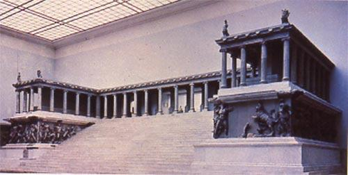

**建筑**：三种柱头（多立克 爱奥尼亚 科林斯），已经出现了剧场（民主意识），

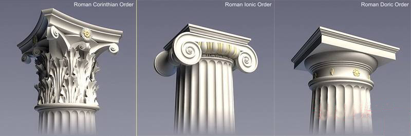

**绘画**：侧面的，黑白陶瓷，晚于雕塑，主要是存不下来（油画利于保存）

[参考](http://www.tucoo.com/art/art003_txt.htm)

### 古罗马艺术

扩张非常快（奥古斯都 屋大维）

王政时代

共和时代

帝国时代（基本都是在这个时期的，开始给帝王塑像，前两个都是民主的）

奥古斯都只是一个头衔

由神向人的转变

《提比略》犹太巡抚

《图拉真》

《奥古斯都》

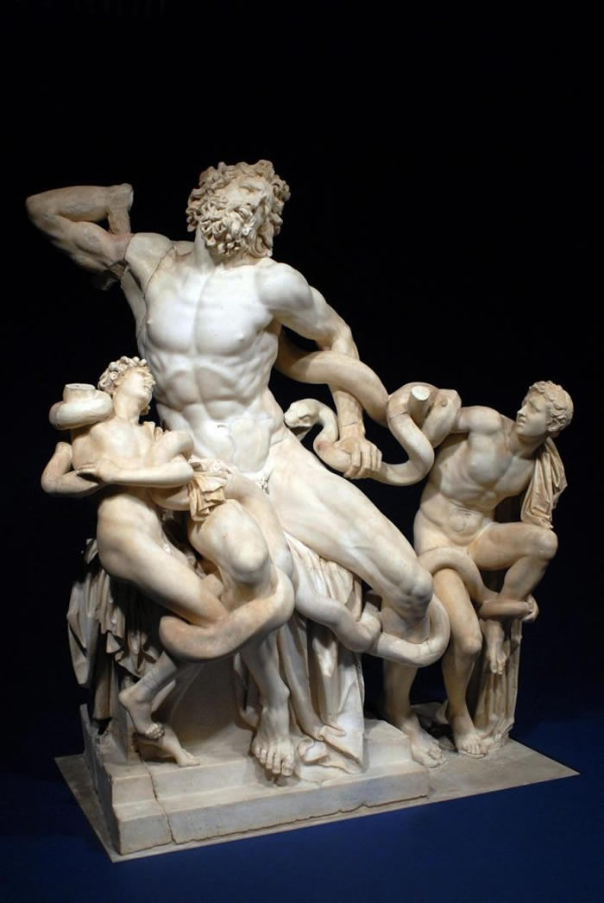

[更多分析](http://www.thepaper.cn/baidu.jsp?contid=1417321) [更多](http://www.tucoo.com/art/art004_txt.htm) 

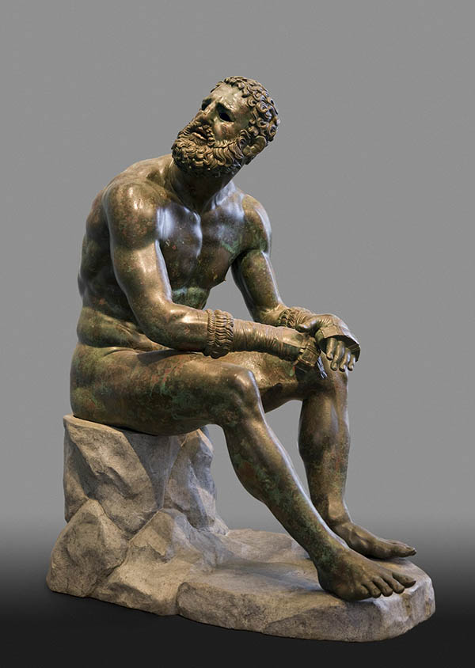

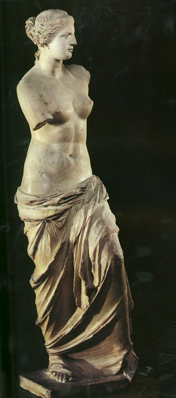

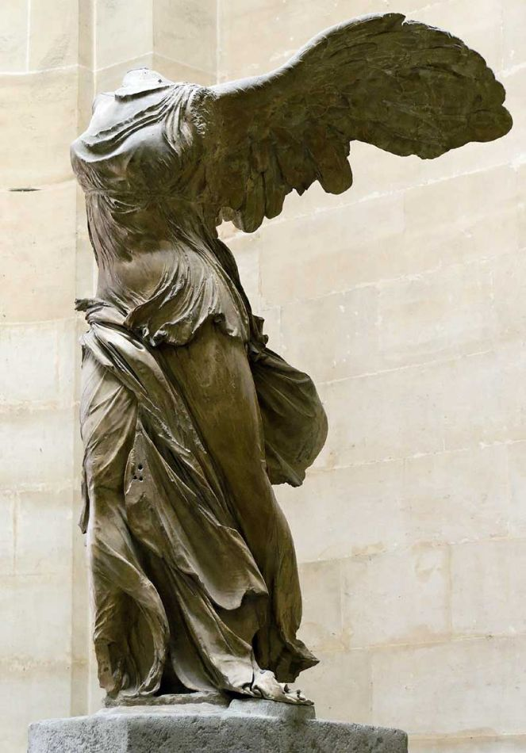

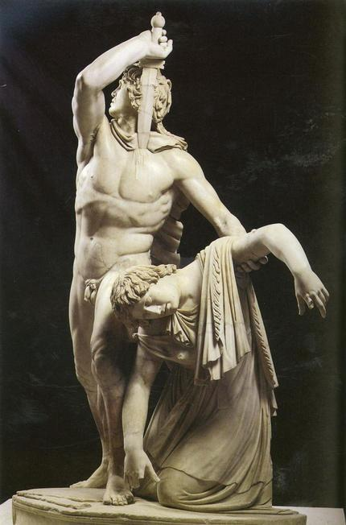

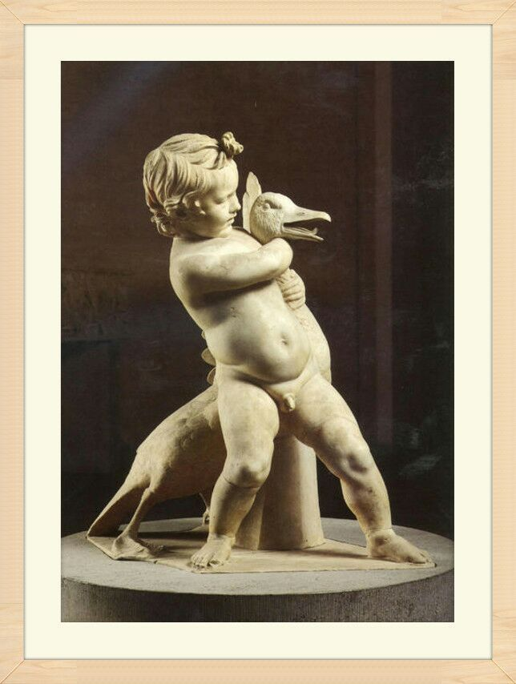

《雅典娜》前200

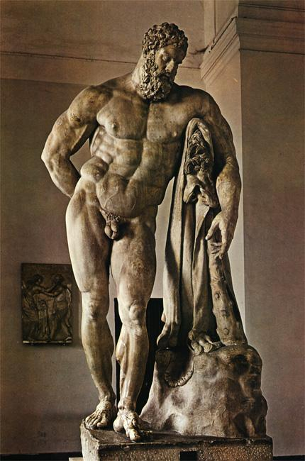

《命运三女神》

《阿瑞斯》前430

《掷铁饼者》

《海神波塞冬》前460

《利切亚青铜像》前460（古典时期）

《维纳斯的诞生》前460

《刺杀者群像》

《德尔斐的驾车人》前478

[参考](http://www.tucoo.com/art/art005_txt.htm)

[人像](http://collection.sina.com.cn/ds/2017-07-07/doc-ifyhwefp0224621.shtml)

## 二、拜占庭帝国（东罗马帝国 土耳其）

圣索菲亚大教堂：只用了五年就造完了，后来改成了清真寺，十字军东征时就已经被洗劫过了，内部比哥特式昏暗，窗户比较小，后来传入俄罗斯 东正教改成了洋葱头

拜占庭的绘画：工艺品和壁画的结合派，有一点淡彩画 马赛克风格壁画，点彩派到视觉原理 造型比较简单 新印象主义 内容单一 都是宗教绘画 颜色简单 主要是内容确定 光环黄色袍子蓝色宗教绘画的固定搭配

## 三、欧洲中世纪末期

君士坦丁米兰sheling 承认基督教 后来就皇帝几乎都是基督徒 所有的国王都是得教皇分

带来商业发达 十字军东征 水路陆路威尼斯都要经过意大利 十字军带掠夺交易性质 所以带回商品在意大利出售 然后钱就多了

有几个家族 比如米蒂奇家族就是骑士 做高利贷 做银行 想洗白 就去捐赠宗教 产生冲突 就选自己儿子当教皇（教堂权利下降）以前都是教皇定画 现在变成家族 后来都可以 导致世俗化题材多样化 神人变成普通人当模特

以前意大利有好几个邦国，当时威尼斯共和国海军非常强大 首脑在欧洲掌权 十字军经常走威尼斯 变成中转海岸 非常富有 有足够的钱吸引艺术家 哪个时期钱多哪里就是艺术中心

弗洛伦萨 罗马 威尼斯

文艺复兴是一点点进入的

杜乔 博宁塞纳 ：中世纪末期

齐马布埃：宝座圣母 只有大小平面

中世纪出现圣母崇拜

文艺复兴：才产生了透视，中世纪只有大小 在平面上罗列

乔托：有一点点透视意识

乔托：朋友但丁，比如塞尚朋友左拉，可以记录下来orz 有透视 立体感 光源 人物表情更丰富 剧场画

太成熟的绘画没有生长空间，现在很多画家通常从古时候找灵感

东方散点透视 西方焦点透视 画家模特不能动

在达芬奇前面都很活泼生动，后来注重技术，开始色调昏暗

乔托钟塔：82m很高了，作为地标，后来旁边就是圣母百花大教堂，里面有一幅画 意大利艺术名人传 米开朗琪罗的学生 以前艺术家地位低 只有这么一本记载

意大利哥特式特别少，就变成地标了

安东尼奥：有了透视的概念 但不是法则 已经很生动了 但是还像中国工笔画一样 前景远景都是清楚的 没有焦距

法布里亚诺 祭坛画放在墙上 博士来朝

安吉利科：一个修士 创作弗洛伦萨圣马可修道院壁画（高于达芬奇的水准？）圣母加冕 颜色很好

真正好的绘画其实颜色不多 在于颜色的微差 色块大小位置 色块分配

善于把纯色搭配出很安静的宗教感的精神性的感觉 一点都不俗气

保罗 乌切洛：圣玛诺之战，突出指挥官；第二幅把视线往中间吸引；生饼的奇迹 反对犹太人的 重点是透视地砖的

马萨乔：

戈佐利：细密画 很具体 但是不像orz

聚光灯其实是一种作假的概念，之前没有 只有线条引导 小洛伦佐出行 他发现了米开朗琪罗的雕塑天赋

老利比：爱旅游 喜欢搞修女 这个时候宗教没有这么森严了  有意识的吧背景压暗 就很清楚 但是很繁杂 学生波蒂切粒 有很强烈的线的色彩勾线秒变 没有强烈的光源的像东方一样靠压色彩突出 圣母子

绘画史总是突然加速 然后缓慢下来之类的

波提切利（小水桶）：维纳斯的诞生 没有主光源 像利比一样勾线 这个时候的古典艺术还是有点神性的 理想的美 和现实美肉欲美不一样

其实很像东方绘画 工笔绘画 东方的美 抽象感 构成感 远近依靠对比强与不强分别

春 也是他的

尼德兰画派（差不多在比利时 低地）

康平

# 2. 文艺复兴时期

15-16c 

好几次十字军东征 伊斯坦布尔东西方文化的交汇处

哥伦布等等的 马可波罗已经写了游记意大利衰落 西欧崛起

### 多纳泰罗

被认为文艺复兴早期的雕塑大师

《大卫》 1476 125cm

### 安德烈·德尔·韦罗基奥

（Andrea del Verrocchio，1435-1488年），原名安德烈·迪·米凯莱·迪·弗朗切斯科·德·[乔尼](https://baike.baidu.com/item/%E5%AE%89%E5%BE%B7%E7%83%88%C2%B7%E5%BE%B7%E5%B0%94%C2%B7%E9%9F%A6%E7%BD%97%E5%9F%BA%E5%A5%A5/5403067)（Andrea di Michele di Francesco de' Cioni），意大利雕刻家、画家和金首饰匠，意大利画家和雕塑家，[达·芬奇](https://baike.baidu.com/item/%E8%BE%BE%C2%B7%E8%8A%AC%E5%A5%87)和[波提切利](https://baike.baidu.com/item/%E6%B3%A2%E6%8F%90%E5%88%87%E5%88%A9)等著名画家都是他的学生，他的学生中还有佩鲁吉诺，而佩鲁吉诺是拉斐尔的老师。他对[米开朗基罗](https://baike.baidu.com/item/%E7%B1%B3%E5%BC%80%E6%9C%97%E5%9F%BA%E7%BD%97/24113)也有很大的影响，是十五世纪下半叶最具影响力的艺术家之一。

### 米开朗基罗

老师认为超过了达芬奇对美术史的贡献

### 美迪奇家族

电影 1492 征服天堂

传说家族初始是骑士的后代

《酒神》

二十多岁时，在当时已经非常逆天了，对比之前的雕塑，首先高度就是一大突破，姿态上学习古希腊的方式，立柱支撑，一条腿虚着，另一条支撑

《罗马圣殇》

梵蒂冈教皇委托他21岁 成名作品

肌肉群一般都是自己添加的 比真人更加丰富 建立在对解剖的理解上 这就是雕塑家牛逼之处

《大卫》

年轻的米开朗基罗已经对雕塑细节有了自己的看法，他没有像罗马圣殇一样抛光的像大理石，而是保留了石材的毛糙。

这是一块5m高的石头的整雕，花了四年时间

大卫在传说中就是一个小男孩，单枪匹马斗怪兽的那种（只有投石机）

雕塑的头部其实很大，是为了从下往上看比例正常。

这个大卫有些角度雄武英姿 有些就是惊恐 有些是愤怒的，展现了人物复杂而真实的性格

# 3. 欧洲中世纪末期 弗洛伦萨

[参考](http://www.chezaiyi.cn/philosophy/229652.html)

让普通百姓知道为什么要捐钱，就要创造许多具体的形象

## 马萨乔

Masaccio，1401—1428

意大利文艺复兴绘画的奠基人，先驱者。被称为**”现实主义开荒者“**。他的壁画是人文主义一个最早的里程碑，是第一位使用**透视法**的画家，在他的画中首次引入了**灭点**。

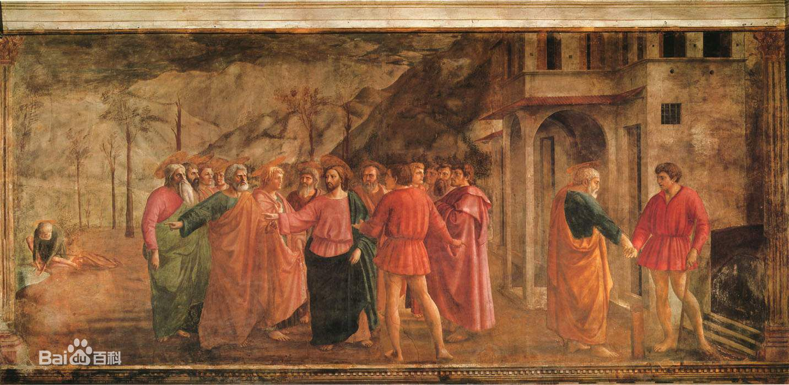

  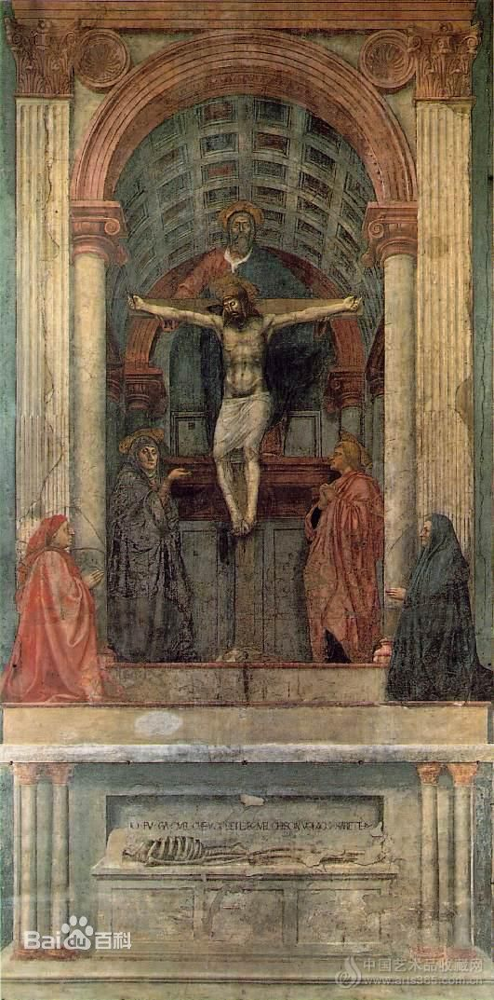

礼拜堂壁画与《三位一体》祭坛画

《纳税银》

《圣母玛利亚》

《圣三位一体像》

《圣母子与圣安娜》

## 菲利普•利比

显示出宗教对僧侣的控制开始松动 为他喜欢的修女和儿子画了一幅《圣母子与两位天使》，触犯教堂，但是收到美第奇家族的保护，得以被逐出修道院还俗成婚。

《圣母子与两位天使》

## 波提切利

是利比的学生 标志着美第奇家族真正开始打造弗洛伦萨艺术王国 开始住进美第奇家族的王宫生活类似门客保养 与之前的赞助不一样 

维纳斯的诞生 是文艺复兴的开始 这个时候不一定要画圣母之类的 开始古希腊一样有神话 这个时候还是平面化的 有明显的勾线

《圣母子与一位天使》

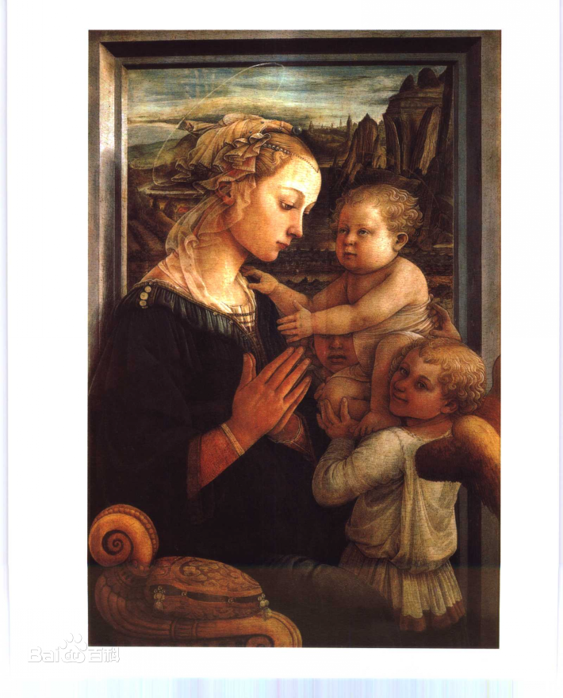

## 菲利皮诺•利比

菲利普的儿子 波提切利的学生

# 4. 尼德兰画派

立体深度空间影响深远

荷兰英文尼德兰 荷兰是尼德兰的伯国

油画：会发黄 干的慢会弄脏艾克是发现亚麻油发黄慢 标志着绘画成熟的开始

色阶多了 更真实 还是有很强的边缘线 是实的 而且很立体

依然以宗教题材为主

## 康宾（1375-1444）

## 威登

三连画：表面有宗教精神的 耶稣下架

透视不统一 使得画面有一种拉长的美感 开始有繁复的风格 贵族的袍子

danpeila油性绘画 小细纹龟裂的效果

油调色会产生更多灰颜色 所以达芬奇也有很多灰色

很多xx下架，对比巴洛克，直挺挺的人物和十字架 纪念碑似的美感 有种悲情的宗教的仪式感 几乎没有一个人比例是合理正常的

一开始先画一个素描层 后来觉得这个也很好 就有这种雕塑似的风格

依然不知道怎么做雕塑

## 扬·凡·艾克

油画：会发黄 干的慢会弄脏

发现亚麻油发黄慢 标志着绘画成熟的开始

也是十五世纪北欧后哥德式绘画的创始人，尼德兰文艺复兴美术的奠基者，油画形成时期的关键性人物，因其对油画艺术技巧的纵深发展做出了独特的贡献，被誉为“油画之父”。

相当于现在的结婚照 不笑庄重 背景昏暗的

蜡烛象征着上帝的光芒 镜子透视很真实

开始有强弱的意识 但是每个细节都不放过

《根特祭坛画》

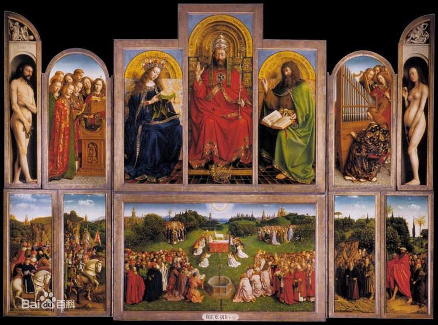

是一种固定的形式 在木板上 但是和壁画不一样

更加自由 不需要去教堂不需要爬上爬下

是可以打开的窗户的样子 有5\*3这么高

先知 圣母玛利亚 仁慈的羔羊献祭 各国使节骑士

唱诗班 上面有亚当夏娃

保存最好的一件 透视开始产生自觉的透视 而去有点浑圆了 有强烈的雕塑感和体积感 与同时期的进步花了大量时间在珠宝服饰上（这个时候教皇开始有钱了）

珠宝写实 徽章是鹈鹕的题材

裂纹是底层开裂 不是油画开裂

油画底层到上层油含量不一样 所以细节不能无限添加 艾克细节很厉害 艾克厉害在宫廷细节 说明专注度和速度很快

比利时绘画最高峰

对比 平面阴影暗部 淡彩画 油画能更加丰富

波姿

他们当时以为最后的晚餐应该这么话 桌子上东西才能知道 人不会被挡住

油画初期和盛期的对比（中间衔接的是尼德兰 造型艺术 空间意识 厚重 含蓄的美 与早期生硬尖锐的不一样

后世对比 收到达芬奇影响 巴洛克时期背景压重 风景没有了

衣服的对比 最好的方法是做个架子画一幅褶皱

